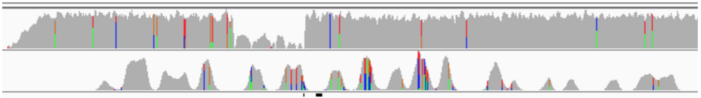
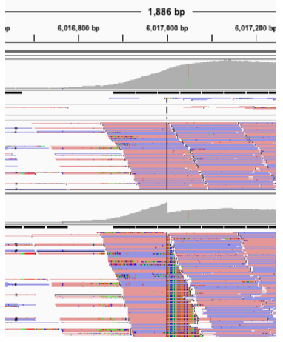
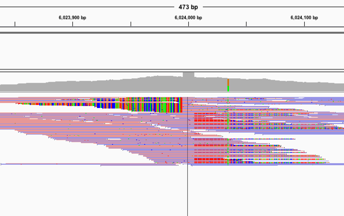
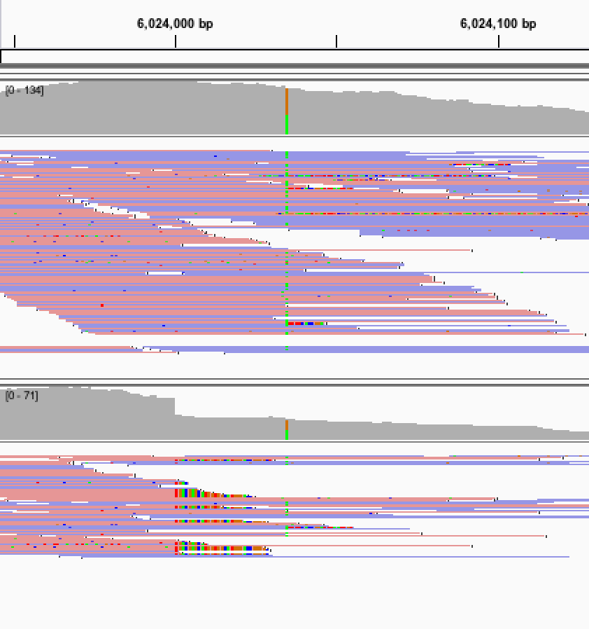

**2022-09-06: clrsvsim is no longer supported or maintained. This repository is archived as read-only for reference**

# clrsvsim
Color Genomics Structural Variant Simulator

# Background
Because structural variants are relatively rare, a simulation is sometimes used to tune and validate tools aimed at detecting and analyzing them.

Structural variant simulators such as [SVGen](http://svgen.openbioinformatics.org/en/latest/) or [SVSim](https://github.com/GregoryFaust/SVsim) work by generating a genome that has structural variants (in `fasta` format), then applying simulators like [wgsim](https://github.com/lh3/wgsim) to synthesize reads from the genome, with a noise model that emulates a particular sequencing technology. This is useful when trying to simulate data in the absence of real human samples. However, it has some drawbacks:
- The simulated reads do not model an assay capture process - depth will typically be stable over the entire sample, rather than concentrated around probes.
- Any synthetic noise model will not accurately match the particular chemistry and setup used in a given lab.

For example, the plot below shows a simulated deletion (top), vs typical coverage from a targeted assay (bottom); note the characteristic probe coverage on the bottom vs artificial stable coverage, although with injected noise, on top:



An alternative method of simulating structural variants would be directly injecting them to aligned reads of an actual sequenced sample, which already incorporates real noise and probe-based coverage. This is what **clrsvsim** does: it modifies BAMs by adding, deleting, and altering its reads; in addition, it can optionally inject additional noise to the reads. 

Currently supported operators are deletions, duplications, insertions, and inversions.

# Limitations
Variants are simulated by modifying individual reads, without considering the mates in paired-end sequencing. These simulations are therefore not suitable to analyze performance of algorithms relying on read pairs.

# Installation 

# Usage

## Duplication / deletion
```
modify_copy_number input_bam output_bam chrom start end \
                   ratio_change, snp_rate indel_rate split_read_ratio random_seed
```
Where
```
  input_bam: The aligned reads to modify.
  output_bam: The modified bam to write.
  chrom: Chromosome to apply modification to.
  start: Start of modification.
  end: End of modification.
  ratio_change: The fraction to increase or decrease reads. Ratios above 1.0 will result in an increase of reads in the region,
  by duplicating current reads in the region with minor modifications. Ratios below 1.0 will result in a reduction of reads in
  the region by randomly subsampling existing reads.
  snp_rate: The fraction of bases that will be modified if new reads are added.
  indel_rate: The fraction of bases that will be inserted or deleted if new reads are added.
  split_read_ratio: The fraction of reads spanning a breakpoint that will be converted to split reads.
  random_seed: The seed to use for random operations.
```
Example (het duplication with no additional noise)
```
from clrsvsim.simulator import modify_copy_number

modify_copy_number(
  input_bam='input.bam',     # This bam needs an index such as the one created by `samtools index`
  output_bam='output.bam',
  chrom='7',
  start=6020605,
  end=6027346,
  ref_genome='ref.fa',
  ratio_change=1.5,
  snp_rate=0.001,
  indel_rate=0
)
```

## Insertion
```
insert_sequence input_bam output_bam chrom position fasta_file \
                insertion_ratio snp_rate indel_rate padding max_clip_len random_seed
```
Where
```
  input_bam: The aligned reads to modify.
  output_bam: The modified bam to write.
  chrom: Chromosome to apply modification to.
  position: Where the insertion should occur.
  fasta_file: A fasta file containing the sequence to insert.
  insertion_ratio: The fraction of input reads that would have an insertion; e.g. 0.5 for heterozygous, 1.0 for homozygous.
  snp_rate: The fraction of bases that will be randomly modified in reads that had an insertion.
  indel_rate: The fraction of bases that will be randomly inserted or deleted in in reads that had an insertion.
  padding: The number of bases around the insertion position that will pad the insertion element.
  max_clip_len: If more than "max_clip_len" of the read would lie within the insertion, then don't apply it, return the original read.
  random_seed: The seed to use for random operations.
```
Example (insertion of an alu from the file `alu.fa`):
```
from clrsvsim.simulator import insert_sequence

insert_sequence(
  input_bam='input.bam',     # This bam needs an index such as the one created by `samtools index`
  output_bam='output.bam',
  chrom='7',
  position=6024000,
  fasta_file='alu.fa',
  insertion_ratio=0.75,
  random_seed=12345
)
```

## Inversion
```
invert_sequence input_bam output_bam chrom start end inversion_ratio \
                snp_rate indel_rate max_clip_len random_seed
```
Where
```
  input_bam: The aligned reads to mod ify.
  output_bam: The modified bam to write.
  chrom: Chromosome to apply modification to.
  start: Start of modification.
  end: End of modification.
  inversion_ratio: The fraction of reads in the region that will be inverted.
  ref_genome: The reference genome. If supplied, will be used to get inversion sequences missing from the alignment.
  snp_rate: The fraction of bases that will be modified, if a read is changed.
  indel_rate: The fraction of bases that will be inserted or deleted, if a read is changed.
  random_seed: The seed to use for random operations.
```
Example (inversion of a 400-base stretch):
```
from clrsvsim.simulator import invert_sequence
invert_sequence(
  input_bam='input.bam',     # This bam needs an index such as the one created by `samtools index`
  output_bam='output.bam',
  chrom='7',
  start=6024000,
  end=6024400,
  inversion_ratio=0.5,
  ref_genome=None,
  snp_rate=0.001,
  indel_rate=0
)
```

# Additional information

## Simulated duplication and deletion

Works by randomly duplicating (or dropping) reads in a given region, including any snps/indels. Reads are further modifies to include additional noise set through parameters (see Usage below). Reads that span the boundary of a structural change are converted to split reads (including modifying their Cigar strings and their actual sequence).

Example result:



## Simulated insertion

Given a sequence in a `fasta` file, converts reads spanning the insertion point to split-reads, where the soft-clipped part is taken from the start/end of the sequence. Reads that are fully within the sequence are not simulated, as they will not be captured with the original assay.

Example result:



## Simulated inversion

Given a start and end of an inversion, first construct the inverted sequence - the complement, reverse of the region being inverted. Reads from the given BAM will be used to build the inverted sequence; if no reads are present for a position, the base in that position will be read from a reference genome (if provided).

After constructing the inverted sequence, the sequence and cigar of every read overlapping the region that's inverted are modified to match the new sequence.

Example result:


